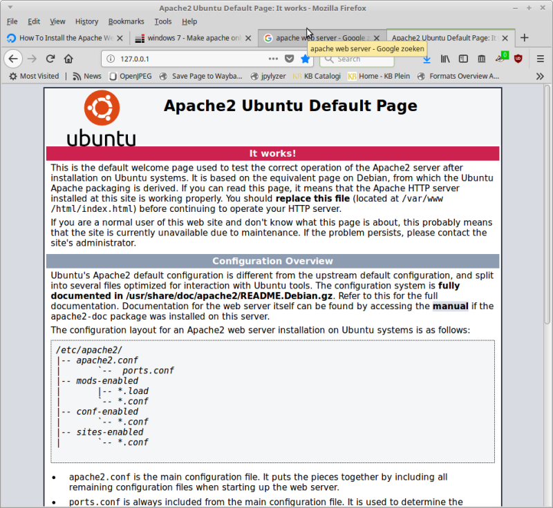

# Liesbet's Atelier Apache setup notes

These notes describe the steps I followed for serving a local copy of the Liesbet's Atelier site. They cover the following subjects:

- how to set up the Apache web server
- how to restrict access to localhost
- how to install a site
- how to enable and configure cgi scripts

These notes are based on Apache/2.4.18 on Linux Mint 19.3/Ubuntu 18.04. They only cover static HTML-based sites. Serving dynamic sites also requires an additional application server and a database (i.e. a full [*LAMP stack*](https://en.wikipedia.org/wiki/LAMP_(software_bundle))).

**!!Important!!** use these notes at your own risk! I'm not an expert on neither web server nor Apache, and these are primarily for my own reference!

## Installation of Apache web server

First update the package index:

```
sudo apt-get update
```

Then install Apache:

```
sudo apt-get install apache2
```

Configuration directory is `/etc/apache2`. Note that the server starts running directly after installation.

## Restrict access to localhost

Running a web server can expose your machine to a number of security threats, so it's a good idea to restrict access to localhost only (this means that only the machine on which the server is running can access it). To do this, locate the file *ports.conf* in the *Apache* configuration directory (`/etc/apache2`), open it in a text editor (as sudo), and then change this line:

```
Listen 80
```

into this:

```
Listen 127.0.0.1:80
```

Save the *ports.conf* file, and restart the web server using:

```
sudo systemctl restart apache2
```

## Check if the server is running

Type the following command:

```
sudo systemctl status apache2
```

Output should be something like this:

```
● apache2.service - LSB: Apache2 web server
    Loaded: loaded (/etc/init.d/apache2; bad; vendor preset: enabled)
    Drop-In: /lib/systemd/system/apache2.service.d
            └─apache2-systemd.conf
    Active: active (running) since Tue 2018-04-10 12:40:29 CEST; 3min 21s ago
        Docs: man:systemd-sysv-generator(8)
    Process: 7756 ExecStop=/etc/init.d/apache2 stop (code=exited, status=0/SUCCESS)
    Process: 5731 ExecReload=/etc/init.d/apache2 reload (code=exited, status=0/SUCCESS)
    Process: 7779 ExecStart=/etc/init.d/apache2 start (code=exited, status=0/SUCCESS)
    CGroup: /system.slice/apache2.service
            ├─7796 /usr/sbin/apache2 -k start
            ├─7799 /usr/sbin/apache2 -k start
            └─7800 /usr/sbin/apache2 -k start

Apr 10 12:40:28 johan-HP-ProBook-640-G1 systemd[1]: Starting LSB: Apache2 web server...
Apr 10 12:40:28 johan-HP-ProBook-640-G1 apache2[7779]:  * Starting Apache httpd web server apache2
Apr 10 12:40:28 johan-HP-ProBook-640-G1 apache2[7779]: AH00558: apache2: Could not reliably determine the server's fully qualified domain name, using 127.0.1.1. Set the 'ServerName' directive globally to suppress this message
Apr 10 12:40:29 johan-HP-ProBook-640-G1 apache2[7779]:  *
Apr 10 12:40:29 johan-HP-ProBook-640-G1 systemd[1]: Started LSB: Apache2 web server.
```

Finally open below URL in your web browser:

<http://127.0.0.1/>

If all goes well this should load the Apache default page:



## Copy the files

Create directory `ziklies.home.xs4all.nl` in `/var/www`. Then from that directory:

```
sudo rsync -avhl /home/johan/kb/liesbets-atelier/liesbets-atelier/ziklies.home.xs4all.nl/ ./
```

Then fix file and directory permissions (note that scripts in cgi-bin directory must be executable!):

```
sudo find . -type d -exec chmod 755 {} \;
sudo find . -type f -exec chmod 644 {} \;
sudo find ./cgi-bin -type f -exec chmod 755 {} \;
```

## General site configuration

Copy default config file to a new one for this site:

```
sudo cp /etc/apache2/sites-available/000-default.conf /etc/apache2/sites-available/ziklies.conf
```

Then edit (as sudo), and adjust DocumentRoot:

```
DocumentRoot /var/www/ziklies.home.xs4all.nl
```

Set the server name (needed to make redirects work):

```
ServerName ziklies.home.xs4all.nl
```

## Add site domain to hosts file

Add this line to the hosts file /etc/hosts (mind the TAB character!):

```
127.0.0.1	ziklies.home.xs4all.nl
```

## Activate configuration

Disable default config, then enable new one: 

```
sudo a2dissite 000-default.conf
sudo a2ensite ziklies.conf
```

## Cgi script configuration

Largely adapted from  [this tutorial](https://code-maven.com/set-up-cgi-with-apache) (after getting stuck with the [official Apache documentation](https://httpd.apache.org/docs/2.4/howto/cgi.html), apparently the configuration is slightly different for Ubuntu/Debian based packages)

First copy default cgi config file to custom one:

```
sudo cp /etc/apache2/conf-available/serve-cgi-bin.conf /etc/apache2/conf-available/serve-cgi-bin-custom.conf
```

Then edit:

```
sudo xed /etc/apache2/conf-available/serve-cgi-bin-custom.conf
```

Then 2 options to link `/cgi-bin` to actual directory location::

1. Use ScriptAlias

    ```
    ScriptAlias /cgi-bin/ /var/www/ziklies.home.xs4all.nl/cgi-bin/
    ```

    This works, but the ScriptAlias method assumes all scripts are in same dir, which is unpractical if we use the server setup for multiple sites later on.

2. Use below configuration (adapted from "User Directories" example [here](https://httpd.apache.org/docs/2.4/howto/cgi.html)). This will work for cgi scripts located in *any* `cgi-bin` folder under `/var/www`:

    ```
    <IfModule mod_alias.c>
        <IfModule mod_cgi.c>
            Define ENABLE_USR_LIB_CGI_BIN
        </IfModule>

        <IfModule mod_cgid.c>
            Define ENABLE_USR_LIB_CGI_BIN
        </IfModule>

        <IfDefine ENABLE_USR_LIB_CGI_BIN>
            <Directory "/var/www/*/cgi-bin">
                Options +ExecCGI
                AddHandler cgi-script .cgi
            </Directory>
        </IfDefine>
    </IfModule>

    # vim: syntax=apache ts=4 sw=4 sts=4 sr noet
    ```

For the Liesbet's Atelier project I went for option 2.

## Activate Cgi script configuration

Disable default, then enable custom config:

```
sudo a2disconf serve-cgi-bin.conf
sudo a2enconf serve-cgi-bin-custom.conf
```

Enable cgi:

```
sudo a2enmod cgi.load
```

Restart server:

```
sudo systemctl restart apache2
```

All done!
