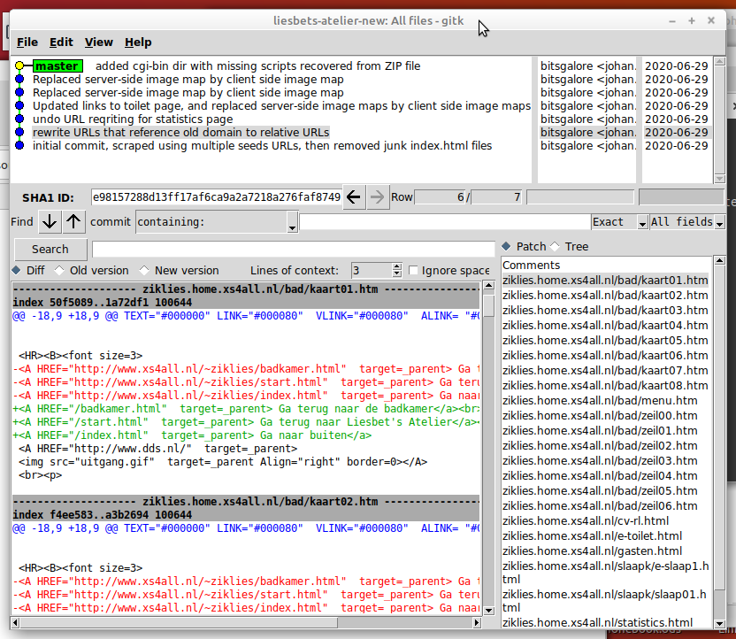

# Liesbet's atelier restoration notes

These notes describe all processing and analysis steps for the restoration of the Liesbet's Atelier site. Live site still here:

<https://ziklies.home.xs4all.nl/>

## Scrape live site

Wget version: GNU Wget 1.19.4 built on linux-gnu.

Script:

[scrapesite.sh](../scripts/scrapesite.sh)

- Toilet missing, bc wrong link! But is on live site:

<https://ziklies.home.xs4all.nl/toilet.html>
<https://ziklies.home.xs4all.nl/e-toilet.html>

On further inspection also various other items missing. So so scraped again using those pages as seeds:

[scrape-seeds.sh](../scripts/scrape-seeds.sh)

Here "$1" is a reference to a text file with seeds URLs of the  'toilet' pages + roots of all (sub)directories:

```
https://ziklies.home.xs4all.nl/
https://ziklies.home.xs4all.nl/toilet.html
https://ziklies.home.xs4all.nl/e-toilet.html
https://ziklies.home.xs4all.nl/atelier/
https://ziklies.home.xs4all.nl/bad/
https://ziklies.home.xs4all.nl/cas/
https://ziklies.home.xs4all.nl/gambia/
https://ziklies.home.xs4all.nl/keuken/
https://ziklies.home.xs4all.nl/slaapk/
https://ziklies.home.xs4all.nl/slaapk/gspot/
https://ziklies.home.xs4all.nl/toilet/
https://ziklies.home.xs4all.nl/woonk/
https://ziklies.home.xs4all.nl/woonk/agenda/
https://ziklies.home.xs4all.nl/zolder/
```

Diff on both captures:

```
diff -r ./wget-site/ziklies.home.xs4all.nl/ ./wget-folders/ziklies.home.xs4all.nl/ > diff-site-folders.txt
```

Result: new capture contains everything that is also in the "regular" capture + 67 additional files/folders.

## Keep track of changes

Site data in Git repo, commit for each modification:




## Lightweight web server for testing

For testing most of the below modifications (apart from the scripting) I used Python's built-in [http.server](https://docs.python.org/3/library/http.server.html). You can start it by simply running the following command from the directory that contains the local site data (e.g. the `ziklies.home.xs4all.nl` directory in the Git repo):

```
python3 -m http.server
```

Subsequently the contents of the directory can be accessed from <http://127.0.0.1:8000/>. Unlike Apache there's no need to for any elaborate configuration, or copying stuff to special locations, which makes it really useful for fast and easy testing. Side note: I wasn't able to make cgi-scripts work from my custom directory, so by for that I used a full-blown [Apache](https://httpd.apache.org/) install instead (I also used Apache for the [WARC capture](./liesbets-atelier-warc-notes.md)).

More info here:

[How do you set up a local testing server?](https://developer.mozilla.org/en-US/docs/Learn/Common_questions/set_up_a_local_testing_server)

## Replace links to website root

For internal links site uses a mixture of relative URLs (which work fine) and absolute ones that use the website root `http://www.xs4all.nl/~ziklies/`, which is forwarded by X4ALL to `https://ziklies.home.xs4all.nl/`. This causes some issues, so I've rewritten these absolute internal URLs as relative links. Script:

<https://github.com/KBNLresearch/xs4all-resources/blob/master/scripts/rewriteurls.sh>

BUT note that this affects the appearance of the statistics page:

<http://127.0.0.1:8000/statistics.html>

Fixed this by undoing commit for this one single file using:

```
git checkout HEAD^ -- ziklies.home.xs4all.nl/statistics.html
```

## Fix links to toilet

In file "start.html":

```
<B><A HREF="http://imagine.xs4all.nl/ziklies/"> 
Ga naar de toilet</a></B>
```

URL points to external domain that doesn't exist anymore. Changed this to local file:

```
<B><A HREF="toilet.html"> 
Ga naar de toilet</a></B>
```

Also changed this in image map.

Likewise for "e-start.html" (with URL "e-toilet.html").

## Image map index page

Original site: server-side [image maps](https://en.wikipedia.org/wiki/Image_map). in HTML:

```
<A HREF="/cgi-bin/imagemap/~ziklies/deurtje1.map"></A>
```

Contents of `DEURTJE1.MAP` file (from ZIP file provided by site creator):

```
default http://www.xs4all.nl/~ziklies/start.html
poly http://www.xs4all.nl/~ziklies/start.html 0,56 76,40 91,43 89,67 76,62 6,77 0,60 1,55 
poly http://www.xs4all.nl/~ziklies/e-start.html 53,72 80,76 81,81 91,85 89,107 76,106 69,137 42,130 51,77
```

Server-side image maps are obsolete and don't work in modern browsers (source), but it is possible to convert the image map into a client-side image map. This can be done by replacing the *A* element in the HTML by this: 

```

<map name="deurtje1Map">
    <area shape="poly" coords="0,56 76,40 91,43 89,67 76,62 6,77 0,60 1,55" href="http://www.xs4all.nl/~ziklies/start.html">
    <area shape="poly" coords="53,72 80,76 81,81 91,85 89,107 76,106 69,137 42,130 51,77" href="http://www.xs4all.nl/~ziklies/e-start.html">
    <area shape="default" href="http://www.xs4all.nl/~ziklies/start.html">
</map>
```

Which works in a modern browser.

## Image map start.html

Same as above:

```
<A HREF="/cgi-bin/imagemap/~ziklies/hal.map">
</A>
```

Server-side image map `HAL.MAP`(from ZIP file provided by site creator):

```
default http://www.xs4all.nl/~ziklies/woonk/woon01.html
rect http://www.xs4all.nl/~ziklies/prikbord.html 69,7 153,57
rect http://www.xs4all.nl/~ziklies/woonk/woon01.html 5,59 63,139
rect http://imagine.xs4all.nl/ziklies/ 5,162 62,242
rect http://www.xs4all.nl/~ziklies/logeer1.html 246,57 307,142
rect http://imagine.xs4all.nl/ziklies/ 247,162 307,244
poly http://www.xs4all.nl/~ziklies/trap.html 170,51 214,4 244,3 246,31 186,72 169,55
rect http://imagine.xs4all.nl/ziklies/ 5,160 62,243
rect http://www.xs4all.nl/~ziklies/keuken/keuken1.html 245,58 306,141
rect http://www.xs4all.nl/~ziklies/logeer1.html 244,161 308,246
```

So convert to:

```

<map name="halMap">
    <area shape="rect" coords="69,7 153,57" href="http://www.xs4all.nl/~ziklies/prikbord.html">
    <area shape="rect" coords="5,59 63,139" href="http://www.xs4all.nl/~ziklies/woonk/woon01.html">
    <area shape="rect" coords="5,162 62,242" href="http://imagine.xs4all.nl/ziklies/">
    <area shape="rect" coords="246,57 307,142" href="http://www.xs4all.nl/~ziklies/logeer1.html">
    <area shape="rect" coords="247,162 307,244" href="http://imagine.xs4all.nl/ziklies">
    <area shape="poly" coords="170,51 214,4 244,3 246,31 186,72 169,55" href="http://www.xs4all.nl/~ziklies/trap.html">
    <area shape="rect" coords="5,160 62,243" href="http://imagine.xs4all.nl/ziklies/">
    <area shape="rect" coords="245,58 306,141" href="http://www.xs4all.nl/~ziklies/keuken/keuken1.html">
    <area shape="rect" coords="244,161 308,246" href="http://www.xs4all.nl/~ziklies/logeer1.html">
    <area shape="default" href="http://www.xs4all.nl/~ziklies/woonk/woon01.html">
</map>
```

## Image map e-start.html

Same as above:

```
<A HREF="/cgi-bin/imagemap/~ziklies/e-hal.map">
</A>
```

Server-side image map `E-HAL.MAP`(from ZIP file provided by site creator):

```
default http://www.xs4all.nl/~ziklies/woonk/e-woon01.html
rect http://www.xs4all.nl/~ziklies/keuken/e-keuk1.html 0,159 66,245 
rect http://www.xs4all.nl/~ziklies/e-logr1.html 246,59 307,142 
rect http://imagine.xs4all.nl/ziklies/ 245,161 308,244 
rect http://www.xs4all.nl/~ziklies/e-prikb.html 69,5 155,57 
poly http://www.xs4all.nl/~ziklies/e-trap.html 167,54 213,1 260,0 255,38 189,82 167,55 
rect http://www.xs4all.nl/~ziklies/woonk/e-woon01.html 2,55 65,140 
```

Convert to:

```

<map name="ehalMap">
    <area shape="rect" coords="0,159 66,245" href="http://www.xs4all.nl/~ziklies/keuken/e-keuk1.html">
    <area shape="rect" coords="246,59 307,142" href="http://www.xs4all.nl/~ziklies/e-logr1.html">
    <area shape="rect" coords="245,161 308,244" href="http://imagine.xs4all.nl/ziklies/">
    <area shape="rect" coords="69,5 155,57" href="http://www.xs4all.nl/~ziklies/e-prikb.html">
    <area shape="poly" coords="167,54 213,1 260,0 255,38 189,82 167,55" href="http://www.xs4all.nl/~ziklies/e-trap.html">
    <area shape="rect" coords="2,55 65,140" href="http://www.xs4all.nl/~ziklies/woonk/e-woon01.html">
    <area shape="default" href="http://www.xs4all.nl/~ziklies/woonk/e-woon01.html">
</map>
```

### Update

As it turns out, image map in Dutch version of the page contains some weirdness (duplicate entries, missing links), so in the end I simply copied the English one over to the Dutch page and then adjusted all links to their Dutch counterparts.

## Image map overloop.html

Same as above:

```
<A HREF="/cgi-bin/imagemap/~ziklies/overloop.map">
</A>
```

Server-side image map `OVERLOOP.MAP`(from ZIP file provided by site creator):

```
default http://www.xs4all.nl/~ziklies/badkamer.html
rect http://www.xs4all.nl/~ziklies/atelier/atelier1.html 1,1 64,98 
rect http://www.xs4all.nl/~ziklies/doka.html 0,102 66,203 
rect http://www.xs4all.nl/~ziklies/slaapk/slaap00.html 195,1 278,102 
rect http://www.xs4all.nl/~ziklies/zolder/zolder1.html 195,104 258,202 
rect http://www.xs4all.nl/~ziklies/trapaf.html 112,176 187,237 
```

Convert to:

```

<map name="overloopMap">
    <area shape="rect" coords="1,1 64,98" href="http://www.xs4all.nl/~ziklies/atelier/atelier1.html">
    <area shape="rect" coords="0,102 66,203" href="http://www.xs4all.nl/~ziklies/doka.html">
    <area shape="rect" coords="195,1 278,102" href="http://www.xs4all.nl/~ziklies/slaapk/slaap00.html">
    <area shape="rect" coords="195,104 258,202" href="http://www.xs4all.nl/~ziklies/zolder/zolder1.html">
    <area shape="rect" coords="112,176 187,237" href="http://www.xs4all.nl/~ziklies/trapaf.html">
    <area shape="default" href="http://www.xs4all.nl/~ziklies/badkamer.html">
</map>
```

## Image map e-overloop.html

Same as above:

```
<A HREF="/cgi-bin/imagemap/~ziklies/e-overl.map">
</A>
```

Server-side image map `E-OVERL.MAP`(from ZIP file provided by site creator):

```
default http://www.xs4all.nl/~ziklies/trapaf.html
rect http://www.xs4all.nl/~ziklies/atelier/e-atelr1.html 1,0 63,99 
rect http://www.xs4all.nl/~ziklies/doka.html 0,104 64,204 
rect http://www.xs4all.nl/~ziklies/slaapk/e-slaap0.html 195,1 278,101 
rect http://www.xs4all.nl/~ziklies/zolder/zolder1.html 195,103 258,210 
rect http://www.xs4all.nl/~ziklies/e-trapaf.html 116,176 188,237 
```

Convert to:

```

<map name="eOverloopMap">
    <area shape="rect" coords="1,0 63,99" href="http://www.xs4all.nl/~ziklies/atelier/e-atelr1.html">
    <area shape="rect" coords="0,104 64,204" href="http://www.xs4all.nl/~ziklies/doka.html">
    <area shape="rect" coords="195,1 278,101" href="http://www.xs4all.nl/~ziklies/slaapk/e-slaap0.html">
    <area shape="rect" coords="195,103 258,210" href="http://www.xs4all.nl/~ziklies/zolder/zolder1.html">
    <area shape="rect" coords="116,176 188,237" href="http://www.xs4all.nl/~ziklies/e-trapaf.html">
    <area shape="default" href="http://www.xs4all.nl/~ziklies/trapaf.html">
</map>
```
## Find forms

```
grep -r "<FORM" ~/kb/liesbets-atelier/liesbets-atelier/ > grep.txt
```

Result:

```
/home/johan/kb/liesbets-atelier/liesbets-atelier/ziklies.home.xs4all.nl/toilet.html:<FORM METHOD="POST" ACTION="/cgi-bin/mail-a-form">
/home/johan/kb/liesbets-atelier/liesbets-atelier/ziklies.home.xs4all.nl/slaapk/e-slaap1.html:<FORM METHOD="POST"
/home/johan/kb/liesbets-atelier/liesbets-atelier/ziklies.home.xs4all.nl/slaapk/slaap01.html:<FORM METHOD="POST"
/home/johan/kb/liesbets-atelier/liesbets-atelier/ziklies.home.xs4all.nl/e-toilet.html:<FORM METHOD="POST" ACTION="/cgi-bin/mail-a-form">
```

## Interactive toilet door

Page:

<https://ziklies.home.xs4all.nl/toilet.html>

Form:

```
<FORM METHOD="POST" ACTION="/cgi-bin/mail-a-form">
<INPUT TYPE="hidden" name="to" value="ziklies">
<INPUT TYPE="hidden" name="nextpage" value="/toilet.html">
<INPUT TYPE="hidden"  NAME="signature" VALUE="toilet@message" >
<INPUT TYPE="text"  NAME="toiletmessage" VALUE="kras hier"SIZE=60>

<!TEXTAREA NAME="message_body" Rows=1 Cols=60 ></TEXTAREA><br>
<p>

<INPUT TYPE="submit" VALUE="verstuur tekst"> . . . . 
<INPUT TYPE="reset" VALUE="wis boodschap"><br>
of een emailtje te sturen met gif-plaatje.
</FORM><br>
```

The `ACTION` attribute of the form points to a form handler (page with script that handles the submitted form data) `http://www.xs4all.nl/cgi-bin/mail-a-form`. It is documented here:

<https://www.xs4all.nl/service/installeren/hosting/mail-a-form-toevoegen/>

So, all the script does is send an email with the entered form data.

On the other hand,  the ZIP file provided by Zikkenheimer contains an old Python script that appears to read a message submitted through the form, and generate an image in-place.

Digging into Internet Archive brought up this old version of the page (which was hosted on a separate server):

<https://web.archive.org/web/19981205234146/http://prima12.xs4all.nl/liesbet/toilet.html>

This also refers to the script from the ZIP file:

```html
<form method="POST" action="/web/19981205234146/http://prima12.xs4all.nl/cgi-bin/Liesbet/wcmuur.py">

<input type="text" name="toiletmessage" value="kras hier" size="60">
```

So the toilet.html/e-toilet.html pages are most likely (very) old versions that pre-date the switch to the python-based version. This is consistent with the author's explanation (email to Kees, October 2019):

> Het scriptje voor de toiletdeur is er misschien niet meer.
> Was door een Delftse student gemaakt en misschien direct in de juiste map
> gezet.
> Zou het niet meer precies weten.
> In eerste instantie maakte ik zelf met de hand een update van de
> toiletdeur. Pas later kwam er dat scriptje.

I did an attempt at restoring the script, but ran into several problems:

- It is based on an ancient (1.4) Python version. It also uses [gdmodule](https://github.com/Solomoriah/gdmodule) which is [not supported](https://github.com/Solomoriah/gdmodule/issues/3) in Python 3.
- I managed to upgrade the script and get the core functionality work under Python 2.7 (adding text to image works), but this requires that the web server has write access to the directory on the server where the image is located, which could be a security risk.
- Also ZIP file only contains GIFs for lowercase characters (with "u" strangely missing!), no numbers, uppercase, etc. Entering any of these characters results in an "Internal Server Error".
- Placement of the text on the GIF also doesn't seem quite right. Not clear if this was the behaviour of the original script, or something introduced with my modifications (especially replacement of obsolete "rand" function).

Also note some old versions of toilet door are still in Internet Archive: 

<https://web.archive.org/web/2003*/http://imagine.xs4all.nl:80/ziklies/wctxt.gif?XXX>

## Slaapkamer form

```
<FORM METHOD="POST"
ACTION="/cgi-bin/barbie.cgi">

<DL>
<DD><b>Als eerste: welke broek of rok moet ze aandoen? </b><br>
<INPUT TYPE="radio" NAME="onder" VALUE="1a" > A1
<INPUT TYPE="radio" NAME="onder" VALUE="2a" > A2
<INPUT TYPE="radio" NAME="onder" VALUE="3a" > A3
<INPUT TYPE="radio" NAME="onder" VALUE="4a" > A4
<INPUT TYPE="radio" NAME="onder" VALUE="5a" > A5
<INPUT TYPE="radio" NAME="onder" VALUE="6a" > A6
<INPUT TYPE="radio" NAME="onder" VALUE="7a" > A7<br>
</DL>
<br>
<DL>
<DD><b>En dan: welk topje, trui, blouze of jasje past daarbij? </b><br>
<INPUT TYPE="radio" NAME="midden" VALUE="1b" > B1
<INPUT TYPE="radio" NAME="midden" VALUE="2b" > B2
<INPUT TYPE="radio" NAME="midden" VALUE="3b" > B3
<INPUT TYPE="radio" NAME="midden" VALUE="4b" > B4
<INPUT TYPE="radio" NAME="midden" VALUE="5b" > B5
<INPUT TYPE="radio" NAME="midden" VALUE="6b" > B6
<INPUT TYPE="radio" NAME="midden" VALUE="7b" > B7<br>
</DL>
<br>
<DL>
<DD><b>En als laatste: welke oorbellen en wat moet ze met haar haar? </b><br>
<INPUT TYPE="radio" NAME="top" VALUE="1c" > C1
<INPUT TYPE="radio" NAME="top" VALUE="2c" > C2
<INPUT TYPE="radio" NAME="top" VALUE="3c" > C3
<INPUT TYPE="radio" NAME="top" VALUE="4c" > C4
<INPUT TYPE="radio" NAME="top" VALUE="5c" > C5
<INPUT TYPE="radio" NAME="top" VALUE="6c" > C6
<INPUT TYPE="radio" NAME="top" VALUE="7c" > C7<br>
</DL><br>
<center>
<INPUT TYPE="submit" VALUE="kijk in de spiegel voor het resultaat">
<br></center>
</FORM>
```

Script `barbie.cgi` (and `barbie1.cgi` for English version) included in ZIP file. Steps:

1. Create `cgi-bin` directory at website root
2. Copy `barbie.cgi` and `barbie.cgi` over to this dir
3. Make it executable using `chmod 755 barbie.cgi`
4. Start server with `--cgi` flag, i.e. `python3 -m http.server --cgi`
5. Inside scripts, replace `http://www.xs4all.nl/~ziklies/` with `/`.

BUT submitting the form then results in this:

```
FileNotFoundError: [Errno 2] No such file or directory: '/home/johan/kb/liesbets-atelier/liesbets-atelier/ziklies.home.xs4all.nl/cgi-bin/barbie.cgi'
```

Unexpected, as neither the form nor the script refer to the `ziklies.home.xs4all.nl` subdomain. After some searching found [this](https://stackoverflow.com/a/14739973/1209004), which suggests the [Shebang](https://en.wikipedia.org/wiki/Shebang_(Unix)) of `barbie.cgi` and `barbie1.cgi` is the problem:

```
#!/usr/local/bin/perl
```

This path doesn't exist on my machine, so changed to:

```
#!/usr/bin/perl
```
t
After this change the script executes without errors when served with Apache. See also the [Apache setup notes](./liesbets-atelier-apache-notes.md) on how to configure Apache properly.


## Inspect site for more scripting

```
grep -r "/cgi-bin" ~/kb/liesbets-atelier/liesbets-atelier/ > scripts-liesbet.txt
```

Result [here](./scripts-liesbet.txt).

- Most are refs to scripts at nedstat.nl (offline; actually slows things down a bit)
- On start.html, new.html: link to voting script http://www.xs4all.nl/cgi-bin/vote/vote.cgi

Nothing that is specific to Liesbet's Atelier, so we can leave this as-is.

## Redaction of guestbook

Following page contains name, email addresses of vistors:

<http://ziklies.home.xs4all.nl/gasten.html>

Must be redacted for a public version (assuming there'll even be a public version at all, which is unsure at this point).

Attention, some more names here:

<http://ziklies.home.xs4all.nl/slaapk/lijst.html>

## Formats

Page "toilet.html" links to 3 QuickTime movie files, but this format is not supported by modern web browsers (but can be played by external players, so could be fixed by migrating). It also links to a Sun Audio (<https://en.wikipedia.org/wiki/Au_file_format>) file.Likewise for "e-toilet.html".

Bedroom page links to [this](https://ziklies.home.xs4all.nl/slaapk/gspot/index.html), which in turn [links](https://ziklies.home.xs4all.nl/slaapk/gspot/gspot.dcr) to an embedded [Adobe Shockwave file](https://en.wikipedia.org/wiki/Adobe_Shockwave).

More info here:

<http://fileformats.archiveteam.org/wiki/Shockwave_(Director)>

<https://en.wikipedia.org/wiki/Adobe_Shockwave>

<https://medium.com/@nosamu/a-tour-of-the-adobe-director-file-format-e375d1e063c0>

How to play these files:

<https://gaming.stackexchange.com/questions/339173/how-can-i-play-dcr-shockwave-games>

Internet Explorer 11: won't install in Wine! Leave this for now.